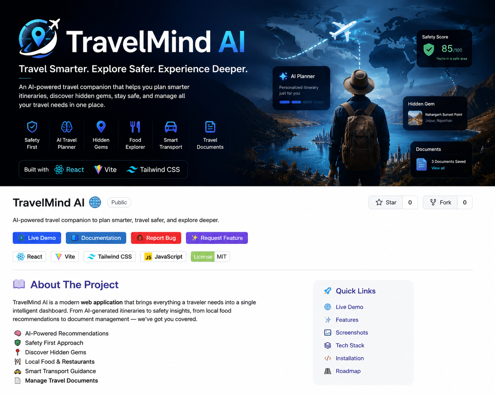

<p align="center">
  
</p>
<div align="center">

# 🌍 TravelMind AI

### **Travel Smarter. Explore Safer. Experience Deeper.**

*A modern AI-inspired travel companion designed to simplify every journey through intelligent planning, safety insights, and personalized travel experiences.*

<br>

[](https://travelmind-ai-one.vercel.app/)
[](https://github.com/MahiVTech/Travelmind-ai-)


</div>

---

# ✨ Overview

Traveling today often means switching between multiple apps—for maps, restaurants, safety, transport, weather, and documents.

**TravelMind AI** brings these experiences together into a single modern interface that helps travelers organize information, explore confidently, and plan trips more efficiently.

This project is currently a **frontend prototype** built to demonstrate the product vision and user experience for an intelligent travel companion.

---

# 🌟 Inspiration

> **What if Google Maps, TripAdvisor, ChatGPT, and a Travel Planner were combined into one intelligent experience?**

TravelMind AI imagines a future where travelers don't need five different applications.

Instead, one smart companion understands where you're going, what you enjoy, and what you should do next.

---

# 🚀 Features

## 🛡️ Smart Safety Dashboard

- Safety overview
- Emergency contacts
- Travel tips
- Area-specific recommendations

---

## 🤖 AI Planner

Plan your journey with an intelligent interface designed for:

- Personalized travel suggestions
- Daily planning
- Smart recommendations
- Future AI itinerary generation

---

## 🍽️ Food Explorer

Discover restaurants and local cuisine.

Features include:

- Local food recommendations
- Regional specialties
- Budget-friendly suggestions
- Popular destinations

---

## 🗺️ Hidden Gems

Explore places beyond traditional tourist attractions.

Designed for:

- Local experiences
- Photography spots
- Peaceful destinations
- Authentic culture

---

## 🚕

Transport Assistant

Navigate cities with ease.

Includes:

- Cab recommendations
- Transport suggestions
- Local travel guidance

---

## 📄 Travel Documents

Keep important information organized.

Future vision includes:

- Passport storage
- Visa information
- Tickets
- Insurance
- Offline access

---

# 📸 Screenshots

## Dashboard

> 


---

## Safety Module

> 


---

## AI Planner

> 


---

## Hidden Gems

> 


---

## Documents

> 


---

# 🛠 Tech Stack

| Technology | Purpose |
|------------|---------|
| React | Frontend Framework |
| Vite | Build Tool |
| Tailwind CSS | Styling |
| JavaScript | Application Logic |
| Lucide React | Icons |
| GitHub | Version Control |
| Vercel | Deployment |

---

# 🏗 Project Structure

```
travelmind-ai
│
├── src
│   ├── App.jsx
│   ├── main.jsx
│   └── index.css
│
├── package.json
├── vite.config.js
├── tailwind.config.js
├── postcss.config.js
├── README.md
└── index.html
```

---

# 🎯 Design Goals

✔ Clean Interface

✔ Modern Dashboard

✔ Responsive Layout

✔ Minimal Design

✔ Easy Navigation

✔ Premium User Experience

---

# 🚧 Future Roadmap

## Version 1.0 ✅

- Modern UI
- Safety Dashboard
- Food Recommendations
- Hidden Gems
- Documents
- Transport Module

---

## Version 2.0 🚀

- Gemini AI Integration
- AI Chat Assistant
- Smart Itinerary Generator
- Weather API
- Budget Planner
- Currency Converter

---

## Version 3.0 🌍

- Offline Mode
- Live Maps
- Voice Assistant
- Real-Time Alerts
- Travel Community
- Emergency SOS

---

# 💻 Getting Started

## Clone Repository

```bash
git clone https://github.com/MahiVTech/Travelmind-ai-.git
```

---

## Open Project

```bash
cd Travelmind-ai-
```

---

## Install Dependencies

```bash
npm install
```

---

## Start Development Server

```bash
npm run dev
```

---

# 🌐 Live Demo

### 🔗 https://travelmind-ai-one.vercel.app/

---

# 📂 GitHub Repository

### 🔗 https://github.com/MahiVTech/Travelmind-ai-

---

# 🎨 UI Highlights

- Dark Premium Theme
- Responsive Design
- Dashboard Experience
- Modern Cards
- Travel-focused Interface
- Minimal User Flow
- Clean Typography

---

# 📈 Current Status

| Module | Status |
|---------|---------|
| UI Design | ✅ Completed |
| Frontend Prototype | ✅ Completed |
| Responsive Layout | ✅ Completed |
| Backend | 🚧 Planned |
| Authentication | 🚧 Planned |
| Database | 🚧 Planned |
| AI Integration | 🚧 Planned |

---

# 💡 Why This Project?

TravelMind AI was created as a portfolio project to explore how artificial intelligence can improve the travel experience through thoughtful design and user-centric planning.

The current version focuses on delivering a polished frontend while laying the foundation for future AI-powered capabilities.

---

# 👩‍💻 Developer

## **Mahi V**

**B.Tech Computer Science (AI)**

Passionate about building intelligent software, modern user experiences, and AI-powered products.

---

# ⭐ Support

If you found this project interesting,

⭐ **consider giving it a Star!**

It motivates future development and helps others discover the project.

---

<div align="center">

### 🌍 TravelMind AI

**Travel Smarter • Explore Safer • Experience Deeper**

Made with ❤️ using React, Vite & Tailwind CSS

</div>
